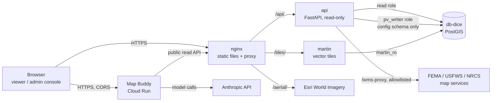

# Architecture

How the Parcel Viewer is put together: what runs where, how a request flows, where the
line between facts and AI sits, and where to change things. For running it, see
`README.md`; for deploying it, `infra/DEPLOY-CHECKLIST.md`; for operating it,
`docs/RUNBOOK.md`; for security, `SECURITY.md`. Decisions are recorded in `docs/adrs/`.

## 1. The system at a glance

**Two deployables** that ship and fail independently:

| Deployable | Runs on | Pieces | Deployed by |
|---|---|---|---|
| **Viewer stack** | A GCE VM (Docker Compose), shared with parcel-studio | `web` (nginx), `api` (FastAPI), `martin` (tiles) | `infra/docker-compose.prod.yml` |
| **Map Buddy** | Google Cloud Run (`core-db-475718`, `us-central1`) | One FastAPI service | `map-buddy/deploy.sh` |

**The viewer works without Map Buddy.** If Map Buddy is down, slow or out of quota, the
AI features switch off and every fact is still shown (see 4).

**Parcel Studio** (a separate repo) embeds this one as a git submodule and adds editing,
authentication and write paths. Nothing here writes parcel data.

## 2. The pieces

### nginx (`infra/nginx.viewer.conf`)
- Serves the static front end: `demo/` (the viewer page), `frontend/public/` (its JS and
  CSS), `engine/` (shared modules), `admin/` (the admin console), and Map Buddy's browser
  files. There is **no build step**: files are served as written, with `no-store` caching.
- Proxies `/api/` → `api`, `/tiles/` → `martin`, `/aerial/` → Esri (cached).
- Owns the hosting-level controls: per-IP rate limits, security headers, CSP, the
  private-file blocks and the access log format (request id, no query strings).
- Re-resolves container names through Docker's DNS, so a rebuilt container is found.
- `/map-buddy-api/` comes from an include: a proxy to a local Map Buddy in development,
  a 404 in production (`infra/nginx/`).

### api (`backend/`)
FastAPI, **synchronous routes** on a bounded `psycopg` pool. Two parts:
- `backend/parcel_viewer/`: the importable package. Routers for parcels (search, records,
  history, bbox, cohort/area queries, style), problem reports and the browser error beacon;
  the DB pool (`db.py`), cohort SQL (`cohort_query.py`), the config store
  (`config_store.py`), and the shared observability module (`common/`).
- `backend/app/main.py`: the standalone app. Adds `/health`, the county config endpoints,
  the admin endpoints (token-guarded) and `/wms-proxy`.

Key properties: a statement timeout on every query; a dead database gives a 503 within
about 10 s and the pool heals itself; bad input gives 400/422, never a 500.

### martin (`infra/martin/martin.yaml`)
Serves Mapbox vector tiles straight from PostGIS **functions** in the `geo` schema
(`geo.parcel_tiles(z, x, y)` becomes the `parcels` layer, and so on). Adding a tile layer
means adding a `geo.<name>_tiles` function in county-data-services and restarting Martin.

### Map Buddy (`map-buddy/`)
- `map-buddy/backend/`: FastAPI on Cloud Run. `/chat` is an agent loop that answers in a
  server-sent-event stream of map **commands** and text. `/explain`, `/describe-cohort`,
  `/kb/resolve` and the workflow routes narrate or look up facts. `/status` and `/health`
  report availability. Quota, caching and cost logging live in `usage.py` and `cache.py`.
- `map-buddy/js/`: the browser client. It streams `/chat` and runs each command only if
  it's in its fixed command table (`_CMDS` in `map-buddy.js`); anything else is ignored.

### The front end (`demo/index.html`, `frontend/public/js/`)
Plain JavaScript modules (IIFEs) on MapLibre GL, loaded in a fixed order by
`demo/index.html`. The large one is `map.js` (map setup, selection, the parcel card, tools).
Others hang off it through a few globals: `PS_MAP` (the map), `PS_BUS` (an event bus),
`PS_selectParcelById`, `PV_COORDS`, and so on. Each module says in its header what it
exposes and what it needs loaded first.

### The engine (`engine/`)
The start of a source-agnostic engine shared with other viewers (ZIP, for zoning). It
holds **no parcel vocabulary** (a test enforces this). It provides the capability contract
(below), theme manifests (`engine/themes/`), the drawing/measure tools, and the test
harness. `engine/README.md` has the details.

### The admin console (`admin/`)
A page for editing the county configuration (layers, labels, integrations, theme). It
reads the published config and writes drafts, publishes and rollbacks through the API's
admin endpoints, which require the admin token (interim until DIC-463).

## 3. How a request flows

**Loading the viewer**
1. nginx serves `demo/index.html` and the scripts it lists.
2. `frontend/public/js/county-config.js` sets a baked copy of the county config; then
   `/api/config.js` replaces it with the **published** config (from the config store, or
   the JSON in `backend/parcel_viewer/county_configs/` if the store is empty or down).
3. `map.js` builds the map from `/api/style.json`, which points MapLibre at `/tiles/`.

**Clicking a parcel:** MapLibre finds the feature in the tile → `GET /api/parcel/{id}`
for the full record → the parcel card renders it (escaped). Search is `GET /api/search`.

**A Neighborhood Profile:** the browser posts an area (a buffer, a drawn polygon, or a
named subdivision / section / township / school district) to `POST /api/cohort`. The API
turns it into one parameterized PostGIS query and returns the parcels; the engine's
cohort core computes the dashboard; Map Buddy (optionally) narrates it.

**Asking Map Buddy something:** the browser posts the message plus the current map context
(the selected parcel's facts, visible layers) to `POST /chat`. The agent may call data
tools (which read the same public parcel API) and answers with map commands and text. The
browser applies a command only if it's in its fixed command table.

**Changing the configuration:** the admin console saves a draft
(`PUT /api/config/{county}/draft`), then publishes it (`POST …/publish`, a new immutable
version) or rolls back to an older one. Viewers pick up the change on their next load.

## 4. The AI boundary

The rule: **facts come from data and code; AI only narrates facts it is given.**

- Every capability (`engine/capability.js`) has a deterministic **core** that produces
  `facts` and `provenance` (where each fact came from), and an optional **narrator**.
- With AI off, only the core runs. The narrator is never called
  (`engine/test/ai-boundary.test.js`), and the facts are identical AI-on and AI-off; only
  the narration differs (`facts-parity.test.js`).
- So every number a user sees (acreage, values, flood zone, the profile's statistics) is
  computed, not generated. AI adds a plain-language reading on top.
- Map Buddy's tools can drive the map and read the public API. They can't write anything,
  hold no credentials, and the browser runs only commands in its fixed table (`_CMDS`).
- **AI is on by default and can be turned off** by the user (the sparkle button). It also
  turns itself off when Map Buddy is unreachable (`pv-ai-health.js`), with hysteresis so a
  single slow response doesn't flip it.

## 5. Configuration and theming

| What | Where | Changed by |
|---|---|---|
| County config: layers, labels, integrations, endpoints (including the Map Buddy URL) | Published versions in the `config` schema; fallback JSON in `backend/parcel_viewer/county_configs/`; baked copy in `frontend/public/js/county-config.js` | Admin console (published), or a PR (fallbacks) |
| Theme manifests (look, capabilities) | `engine/themes/*.json`, listed in `engine/themes/index.json` | PR |
| Server settings | Environment variables per service (`infra/DEPLOY-CHECKLIST.md` lists all of them) | Deploy |
| User preferences (units, coordinate format, dark mode, accessibility) | The browser's `localStorage` | The user (Settings) |

The Map Buddy URL must be the same in the three config copies; `engine/test/endpoints.test.js`
fails if they differ or if code hard-codes it.

## 6. Observability

- **Request ids** on every response (`X-Request-ID`), in every log line and in nginx's
  access line, so one id traces a request end to end.
- **JSON logs** in the images (`LOG_FORMAT=json`), readable text locally.
- **Sentry** through an injected `ErrorLoggingClient`, a no-op until `SENTRY_DSN` is set.
  Load and outages (database busy, AI quota, federal map services down) are logged as
  warnings, not sent to Sentry.
- **Browser errors** reach the API through `pv-error-beacon.js` → `/api/client-errors`.
- **Health:** `/api/health` (503 when the database is down); Map Buddy `/health` and `/status`.
- **AI cost:** each model call logs its token counts, including cache reads.

See ADR 0001 and `docs/RUNBOOK.md`.

## 7. Testing

| Layer | Where | Runs in CI |
|---|---|---|
| Engine and front-end units (Node) | `engine/test/*.test.js` | Yes |
| Python contracts (stdlib only) | `engine/test/run_*_test.py` | Yes |
| API and Map Buddy (FastAPI TestClient; no DB, no model) | `backend/**/tests`, `map-buddy/backend/tests` | Yes |
| Lint, format, types, secrets | pre-commit (ruff, mypy, gitleaks) | Yes |
| Security scanning | CodeQL | Yes, plus weekly |
| Browser end-to-end + accessibility (Playwright, axe) | `e2e/` | No: needs a database. Run locally against the stack |

## 8. Where to change things

| To… | Look at |
|---|---|
| Add a map layer | A `geo.<name>_tiles` function (county-data-services), then the county config (admin console) |
| Add an API route | `backend/parcel_viewer/routers/`, with a test in `backend/**/tests` |
| Change a limit or timeout | Its environment variable (`infra/DEPLOY-CHECKLIST.md`); nginx limits in `infra/nginx.viewer.conf` |
| Add a Map Buddy command | The tool in `map-buddy/backend/agent.py` **and** its handler in `_CMDS` (`map-buddy/js/map-buddy.js`) |
| Add an explainer or other capability | A core in `engine/capabilities/`, registered in `register.js` |
| Change the look | Theme tokens in `frontend/public/css/style.css`; the theme manifest |
